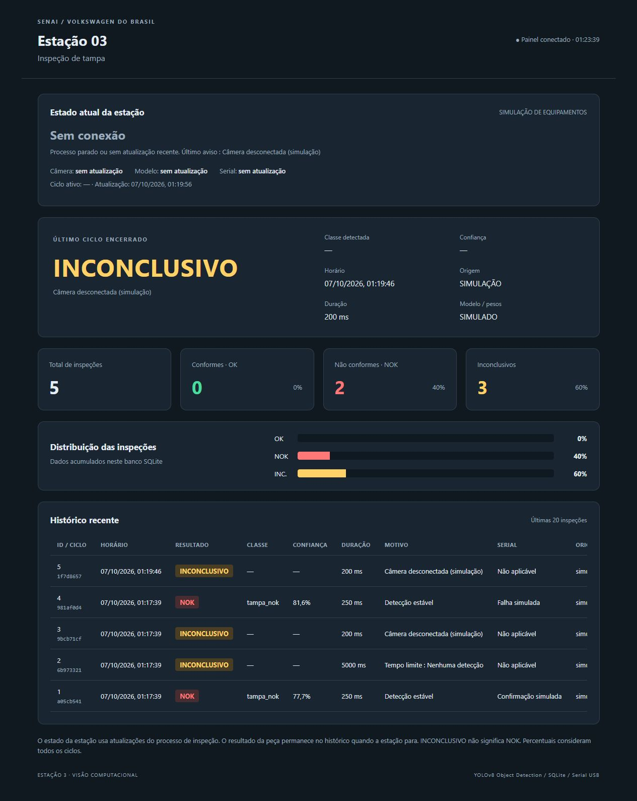

# Estação 3 — inspeção de tampa SENAI / Volkswagen do Brasil

A Estação 3 faz **detecção e classificação da condição da tampa como OK/NOK com YOLOv8 Object Detection**. A peça permanece parada durante a avaliação. A inferência roda localmente no PC. O Arduino apenas recebe o resultado; a interface física e o protocolo entre estações ainda dependem do professor.

## Estado do projeto

| Parte | Situação |
|---|---|
| Software, banco e supervisório | Implementados; 33 testes de software passaram |
| Demonstração sem equipamento | Disponível pelo simulador de ciclos e falhas |
| Dataset e modelo treinado da tampa | Pendentes |
| Webcam e Arduino físicos | Ainda precisam de validação |
| Integração com a mesa e outras estações | Aguardando definição do professor |



*Captura de uma simulação: uma falha de câmera encerrou a tentativa como INCONCLUSIVO. O processo já estava parado na imagem, por isso a estação aparece sem conexão.*

## Começar pela demonstração sem hardware

Na raiz do projeto, com Python instalado:

```powershell
python -m venv .venv
.\.venv\Scripts\Activate.ps1
python -m pip install flask
$env:ESTACAO3_DB = 'supervisorio/simulacao.db'
python supervisorio/app.py
```

Em outro terminal, também na raiz:

```powershell
python supervisorio/simulador.py --cenario misto --quantidade 8 --intervalo 2 --seed 42
```

Abra **http://127.0.0.1:5000**. Essa demonstração não usa câmera, pesos YOLO ou Arduino. Ela mostra o fluxo de ciclos, histórico, gráfico e falhas técnicas.

Documentação:

- [Guia de demonstração](GUIA_DEMONSTRACAO.md): roteiro para apresentar o projeto.
- [O que foi desenvolvido](ALTERACOES.md): funções de cada parte e mudanças nos scripts originais.
- [Validação atual](VALIDACAO_CICLOS.md): testes realizados e limitações.
- As seções abaixo explicam instalação completa, dataset, treinamento, inferência e Arduino.

## Arquitetura implementada

```text
Webcam USB → OpenCV/Python → YOLOv8 (best.pt) → ciclo de inspeção + confirmação estável
                                              ├→ SQLite → Flask → dashboard
                                              └→ Serial USB opcional → Arduino Uno
```

O Flask consulta o mesmo banco que a inferência escreve. O painel atualiza a cada 2 segundos, sem recarregar a página. Os gráficos usam HTML/CSS e JavaScript locais, sem CDN. O painel separa **estado atual da estação** (atualizações do processo) de **último ciclo encerrado** (histórico). A conexão com Flask não comprova conexão da câmera. Se o processo parar ou não atualizar por 8 segundos, a estação aparece SEM CONEXÃO; um OK antigo continua apenas como histórico.

## Estrutura

```text
config.py                         Configurações centralizadas
listar_cameras.py                 Identificação da webcam no Windows
captura_dataset.py                Captura com 1 / 2 / Q
treinar.py                        Treinamento YOLOv8 de detecção
inferencia.py                     Inferência, evidência e Serial
ciclo.py                          Máquina de estados independente do hardware
requirements.txt                  ultralytics, opencv-python, pyserial, flask
.gitignore                        Ignora dataset, pesos e bancos locais
gitignore                         Arquivo original preservado
supervisorio/
  __init__.py
  database.py                     sqlite3 padrão; WAL; conexões curtas
  app.py                          Flask e APIs JSON
  simulador.py                    Somente execução explícita
  templates/index.html
  static/style.css
  static/dashboard.js
arduino/estacao3_serial/
  estacao3_serial.ino              Receptor Serial; LED provisório
tests/test_estacao3.py             Testes da base
tests/test_ciclos.py               Ciclos, falhas, migração e ACK
GUIA_DEMONSTRACAO.md              Apresentação sem tampa/câmera/modelo
VALIDACAO_CICLOS.md               Validação da versão atual
```

As pastas dataset/, dataset_roboflow/, runs/ e o banco são criados/usados conforme necessário. Não há dataset rotulado nem best.pt incluídos. Todos os caminhos padrão partem da pasta de config.py, independentemente do diretório atual.

## Instalar (Windows / PowerShell)

Abra o terminal na pasta do projeto. Recomenda-se Python 3.11 ou 3.12 para maior compatibilidade com PyTorch/Ultralytics. A disponibilidade de dependências deve ser verificada no PC de operação.

```powershell
python -m venv .venv
.\.venv\Scripts\Activate.ps1
python -m pip install -r requirements.txt
```

Caso a ativação esteja bloqueada, use diretamente `.\.venv\Scripts\python.exe` em lugar de `python`. SQLite usa sqlite3 do próprio Python, sem pacote adicional. Para testar apenas o supervisório, basta instalar Flask (`python -m pip install flask`). A operação de inferência não usa serviços de nuvem; instale dependências e obtenha os pesos antecipadamente.

## 1. Identificar e configurar câmera

```powershell
python listar_cameras.py
```

O utilitário testa os índices 0 a 4 usando o backend Windows MSMF. Pressione uma tecla no preview para passar ao próximo índice. Ajuste **CAM_INDEX em config.py** para a webcam USB. Captura e inferência usam o mesmo índice. Este projeto mantém o backend Windows do script original.

## 2. Capturar e rotular dataset

```powershell
python captura_dataset.py
```

- 1: dataset/tampa_ok/tampa_ok_0001.jpg e seguintes.
- 2: dataset/tampa_nok/tampa_nok_0001.jpg e seguintes.
- Q: sair.

A imagem salva é uma cópia limpa do mesmo frame do preview, antes dos textos. O contador retoma a maior sequência existente, evitando sobrescritas se imagens foram removidas. A tela mantém contador, preview e atalhos originais.

Crie no Roboflow um projeto de **Object Detection**, envie as imagens e desenhe bounding boxes na tampa. A pasta de captura indica a condição, mas **não substitui os rótulos de detecção**. Use os nomes exatos tampa_ok e tampa_nok. Separe treino/validação/teste evitando imagens quase idênticas da mesma sequência em partições diferentes. Exporte no formato YOLOv8 e extraia em dataset_roboflow/.

Verifique data.yaml: names, nc e caminhos train/val/test devem corresponder às imagens e labels extraídos. Os caminhos relativos de exportações Roboflow podem precisar de ajuste. Configure DATA_YAML em config.py. A validação do script impede download automático de outro dataset.

## 3. Treinar e localizar best.pt

```powershell
python treinar.py
```

config.py concentra MODELO_BASE=yolov8n.pt, EPOCHS=100, IMG_SIZE=640, BATCH=16 e PATIENCE=20. O treinamento é de detecção; não troca para -cls. O peso base oficial pode ser baixado pelo Ultralytics no primeiro uso, se ausente. O dataset precisa ser fornecido pelo grupo.

Resultados ficam em runs/estacao3/tampa/. Para preservar treinos anteriores, Ultralytics pode criar tampa2/, tampa3/, etc. O programa imprime o **caminho efetivo de model.trainer.best**, em vez de assumir runs/detect/train. Copie esse caminho para MODEL_PATH em config.py. O padrão aponta para runs/estacao3/tampa/weights/best.pt. Mensagens orientam sobre YAML inexistente, dataset inválido, falha de carga e erro de treino. Ajuste BATCH se faltar memória. Dataset inválido pode envolver problemas que só aparecem durante o treinamento.

## 4. Inferência e ciclo de inspeção

Configure MODEL_PATH e CAM_INDEX em config.py; deixe USE_SERIAL=False para começar sem Arduino.

```powershell
python inferencia.py
```

O padrão agora é **INSPECTION_MODE="manual"**. Posicione a peça, pressione **I** na janela do preview e aguarde uma decisão. Q encerra. Apertar I durante inspeção ou cooldown não inicia outro ciclo. Cada início gera um ID único; esse ID identifica a tentativa, não uma peça física rastreada pela mesa. Uma segunda solicitação manual pode inspecionar novamente a mesma peça.

```text
AGUARDANDO → I → INSPECIONANDO → CONCLUIDO (OK / NOK / INCONCLUSIVO)
                         └→ FALHA da estação (ciclo ativo termina INCONCLUSIVO)
```

- OK/NOK exigem uma única detecção válida e a mesma classe/condição por STABLE_FRAMES.
- Sem detecção, múltiplas boxes ou classe desconhecida aguardam até o prazo.
- Prazo vencido gera INCONCLUSIVO com motivo; não vira NOK.
- Falha de câmera/modelo durante ciclo gera INCONCLUSIVO e falha da estação.
- Falha antes de iniciar um ciclo não cria inspeção fictícia.
- Q durante ciclo registra cancelamento como INCONCLUSIVO.
- O estado CONCLUIDO permanece até o próximo comando; não confirma novamente a cada frame.

| Configuração | Padrão | Função |
|---|---:|---|
| CONF_THRESHOLD | 0.70 | Confiança mínima |
| STABLE_FRAMES | 5 | Frames consecutivos |
| INSPECTION_TIMEOUT_SECONDS | 5.0 | Tempo máximo de avaliação |
| COOLDOWN_SECONDS | 2.0 | Intervalo após fim antes de outro início |
| INSPECTION_MODE | manual | Comando I; automatico é demonstração |
| REARM_FRAMES | 10 | Rearme por ausência, apenas no automático |
| HEARTBEAT_SECONDS | 1.0 | Atualização do estado pelo processo |
| STATION_STALE_SECONDS | 8.0 | Prazo para indicar falta de atualização |

O prazo é verificado entre chamadas ao detector; não interrompe uma chamada bloqueada de OpenCV/YOLO. Se o processo travar, o painel perde a atualização após o prazo de heartbeat. Não é um controlador de segurança da mesa.

O modo `automatico` preserva a demonstração por presença de detecção e retirada. Ele não tem sensor real: oclusão pode causar rearme e não é possível concluir que uma peça sem detecção chegou. Para testar falta de tampa no modo manual, inicie um ciclo mesmo sem detecção. O gatilho definitivo será conectado futuramente à função iniciar() de CicloInspecao, sem assumir protocolo entre estações.

## 5. Histórico, evidência e dashboard

Em outro terminal:

```powershell
python supervisorio/app.py
```

Abra http://127.0.0.1:5000. Também funciona `python -m supervisorio.app`. Servidor local, sem debug.

O painel mostra estado da estação, disponibilidade de câmera/modelo/Serial, ciclo ativo, horário da atualização, último ciclo, motivo, duração, versão do modelo, totais, gráfico e últimas 20 tentativas. Status de equipamento é informado pelo processo; em simulação, o painel identifica SIMULAÇÃO DE EQUIPAMENTOS. Se não houver atualização, não apresenta os últimos estados como disponibilidade atual.

- GET /api/status: estado da estação, último ciclo, contagens, gráfico e histórico.
- GET /api/historico: últimas 20 inspeções.
- GET /api/inspecoes/<id>/imagem: foto registrada, quando existir.

O banco supervisorio/inspecoes.db armazena resultado, classe/confiança (podem ser vazios para inconclusivo), origem, ID único do ciclo, horário de início/fim, duração, motivo, versão do modelo, referência da imagem e estado do envio Serial. A versão inclui MODEL_VERSION e hash parcial SHA-256 do arquivo real de pesos; renomear o arquivo não muda o hash.

O gráfico inclui OK, NOK e INCONCLUSIVO. Percentuais usam todas as tentativas como denominador, não apenas as peças avaliadas. Migração do banco da versão anterior é automática e transacional, preservando IDs e registros. Faça uma cópia do banco antes de atualizar um PC que já tenha histórico importante. Pare os processos da versão anterior antes da migração.

SAVE_IMAGES=True salva o último frame limpo capturado em inspecoes_imagens/<ciclo_id>.jpg para os resultados de SAVE_IMAGE_RESULTS. O histórico oferece link da foto. Falha ao salvar imagem não elimina o resultado; fica registrada no motivo. Queda de câmera não usa foto antiga como evidência da falha. Não há política de exclusão automática de imagens: monitore o espaço e arquive quando necessário. Uma queda entre salvar a foto e gravar o banco pode deixar uma imagem sem registro.

## 6. Simulação de ciclos e falhas

O simulador usa **supervisorio/simulacao.db por padrão**. Não inicia automaticamente e não usa câmera/modelo/Serial reais. Para o dashboard consultar esse banco, configure no terminal do Flask:

```powershell
$env:ESTACAO3_DB = 'supervisorio/simulacao.db'
python supervisorio/app.py
```

Em outro terminal:

```powershell
python supervisorio/simulador.py --cenario misto --quantidade 8 --intervalo 2 --seed 42
```

Cenários: normal, sem-deteccao, camera-falha, serial-falha e misto. Cada ciclo apresenta fases aguardando/inspecionando/resultado; intervalo controla a pausa entre fases. Durações dos registros são simuladas. O modo misto alterna os quatro cenários. Não gera imagens fictícias nem confirmações físicas do Uno. Quando o simulador termina, a estação aparece SEM CONEXÃO e o histórico permanece.

Se ESTACAO3_DB estiver definido no terminal do simulador, ele usa esse banco. Para outro banco, configure a mesma variável nos dois terminais. Há uma única sessão ativa por banco: inferência e simulador simultâneos são recusados enquanto houver atualização recente. Isso impede concorrência ativa, mas executar simulação num banco com histórico real ainda mistura os totais; use o banco separado.

Para voltar à operação real, pare os processos e execute `Remove-Item Env:ESTACAO3_DB` no terminal do Flask antes de reiniciar. Consulte GUIA_DEMONSTRACAO.md para um roteiro sem hardware.

## 7. Arduino Uno / Serial com confirmação

Abra arduino/estacao3_serial/estacao3_serial.ino na Arduino IDE, selecione Uno/porta e carregue. Código continua somente recepção de resultado e LED provisório, sem I2C ou atuador.

O sketch mantém compatibilidade com `OK\n` e `NOK\n` para o Monitor Serial a 9600 baud; aceita CRLF. LED_BUILTIN ligado indica OK e desligado indica NOK, apenas demonstração. Estado inicial também deixa LED apagado.

Com SERIAL_REQUIRE_ACK=True, o Python usa protocolo correlacionado exclusivamente PC ↔ Uno:

```text
PC:      RESULTADO;<id_hexadecimal_32_caracteres>;OK\n
Arduino: ACK;<mesmo_id>;OK\n
```

NOK segue o mesmo formato. O Python só considera confirmado se o ID e o resultado coincidirem, dentro de SERIAL_ACK_TIMEOUT (1 segundo). ACK de outro ciclo é ignorado. Sem ACK, o resultado continua no banco com sem_confirmacao; não se repete o envio automaticamente. A confirmação indica recepção pelo sketch, não atuação física.

INCONCLUSIVO não é transmitido como OK/NOK; fica registrado localmente, com nao_aplicavel para Serial. O último resultado do Uno pode continuar sendo de outro ciclo, então ele não deve ser interpretado como decisão de uma nova peça. A comunicação definitiva de falhas à mesa ainda depende do professor.

Configure USE_SERIAL=True, SERIAL_PORT e BAUD_RATE. Feche o Monitor Serial antes de abrir Python. O Uno pode reiniciar ao abrir a USB; há espera configurável de 2 segundos. Falha de conexão/envio não encerra a avaliação local; o painel e o histórico mostram o problema. Reconexão exige reiniciar. Para testar o protocolo simples com um sketch antigo, SERIAL_REQUIRE_ACK=False usa OK/NOK, identificado como escrito_sem_ack, sem comprovar recepção.

## IMPLEMENTADO

- Captura e treinamento existentes preservados, com correções documentadas.
- Ciclos explícitos, estabilidade, prazo, cooldown e estados da estação.
- OK/NOK separados de INCONCLUSIVO e falha técnica.
- Histórico com ID único, duração, motivo, versão/hash dos pesos e imagem.
- Heartbeat local, detecção de atualização obsoleta e sessão única por banco.
- Dashboard com três resultados e acesso às imagens.
- Simulador explícito de ciclos e falhas em banco separado por padrão.
- Serial USB opcional, ACK correlacionado e sketch compatível com teste manual.
- Testes de software; consulte VALIDACAO_CICLOS.md para a versão atual.

## FUTURO / PENDENTE

- Dataset rotulado real, treinamento e avaliação de precisão/falsos OK/falsos NOK.
- Calibração de câmera, iluminação, limiar e estabilidade na estação real.
- Gatilho definitivo de inspeção e identificação de peças pela mesa.
- Comunicação definitiva entre estações, a ser definida pelo professor; I2C não foi implementado.
- Integração com o supervisório geral.
- Associação modelo do carro ↔ tipo/cor de tampa.
- Integração física final da mesa e eventuais atuadores.

Não há controle de robôs, outras estações, atuadores ou protocolo definitivo da mesa.

## Testes de software

Após instalar as dependências:

```powershell
python -m compileall -q .
python -m unittest discover -s tests -v
```

Os testes usam bancos temporários, mocks de câmera/modelo/ACK e loopback Serial simples no PC. Eles não comprovam funcionamento físico da webcam, do Uno nem inferência com pesos reais.

O repositório inclui um fluxo GitHub Actions que executa a sintaxe e a suíte em Windows com Python 3.12, usando as dependências de teste e mocks de YOLO. O resultado local de 33 testes não implica aprovação da execução remota; consulte a aba Actions após publicar. A automação não testa equipamento físico nem treina um modelo.

## Autor

Davi — Estudante de Ciência da Computação (FEI) e aprendiz de mecatrônica (SENAI/Volkswagen do Brasil).

Referências de implementação: documentação oficial Ultralytics [treinamento](https://docs.ultralytics.com/modes/train/), [predição](https://docs.ultralytics.com/modes/predict/) e [trainer.best](https://docs.ultralytics.com/reference/engine/trainer/).
